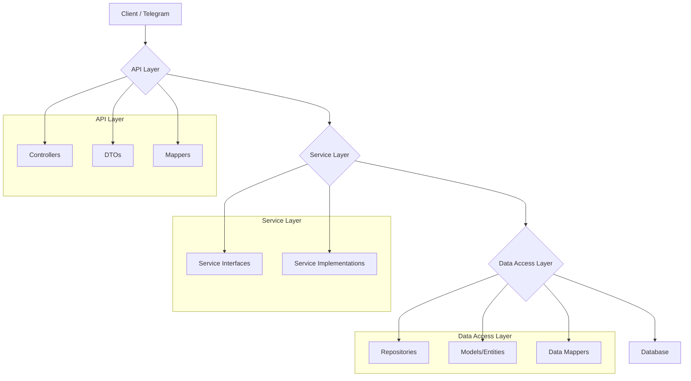

# System Patterns: Geohod Backend

## Core Architecture: Layered Monolith

The application follows a classic layered (or n-tier) architecture, which is typical for Spring Boot applications. This separates concerns into distinct layers, promoting modularity and maintainability.

### Layer Breakdown

1.  **API Layer (`me.geohod.geohodbackend.api`)**:
    *   **Controllers (`...api.controller`)**: Responsible for handling incoming HTTP requests, validating input, and returning responses. They orchestrate calls to the service layer.
    *   **DTOs (`...api.dto`)**: Data Transfer Objects are used to define the public-facing contract of the API. They are used for both request payloads and response bodies. This decouples the API from the internal data model.
    *   **Mappers (`...api.mapper`)**: MapStruct mappers are used to convert between API DTOs and internal DTOs or domain models used by the service layer.

2.  **Service Layer (`me.geohod.geohodbackend.service`)**:
    *   **Service Interfaces (`...service.I...Service`)**: Define the business logic contracts.
    *   **Service Implementations (`...service.impl`)**: Contain the core business logic of the application. They coordinate operations, enforce business rules, and interact with the data access layer. This layer is transactional.

3.  **Data Access Layer (`me.geohod.geohodbackend.data`)**:
    *   **Repositories (`...data.model.repository`)**: Interfaces that extend Spring Data JDBC repositories. They define the methods for database operations (CRUD, queries).
    *   **Models/Entities (`...data.model`)**: Represent the database tables. These are simple Java objects, likely annotated for use with Spring Data JDBC.
    *   **Data Mappers (`...data.mapper`)**: MapStruct mappers responsible for converting between database entities and internal DTOs used by the service layer.

## Key Design Patterns & Concepts

*   **Dependency Injection (DI)**: Spring's Inversion of Control (IoC) container manages the lifecycle of beans. Constructor injection is preferred for creating loosely coupled components.
*   **Repository Pattern**: The data access layer uses repositories to abstract database interactions, making the code cleaner and easier to test.
*   **Data Transfer Object (DTO) Pattern**: DTOs are used extensively to transfer data between layers, preventing the exposure of internal database models to the client.
*   **Outbox Pattern**: The presence of `TelegramOutboxMessage` and `IOutboxProcessor` suggests the use of the outbox pattern for reliable messaging, likely for sending notifications to Telegram. This ensures that notifications are sent even if the external service is temporarily unavailable.
*   **Strategy Pattern**: The notification system (`InAppNotificationProcessor`, `TelegramNotificationProcessor`) likely uses the Strategy pattern to handle different types of notifications (e.g., in-app vs. Telegram) in a pluggable way.
*   **Global Exception Handling**: `GlobalExceptionHandler` provides a centralized place to handle exceptions thrown from any layer, ensuring consistent error responses in the API.
*   **Security via Filters**: `TelegramInitDataAuthenticationFilter` indicates that security is handled by a custom filter in the Spring Security chain, which intercepts requests to perform authentication.
