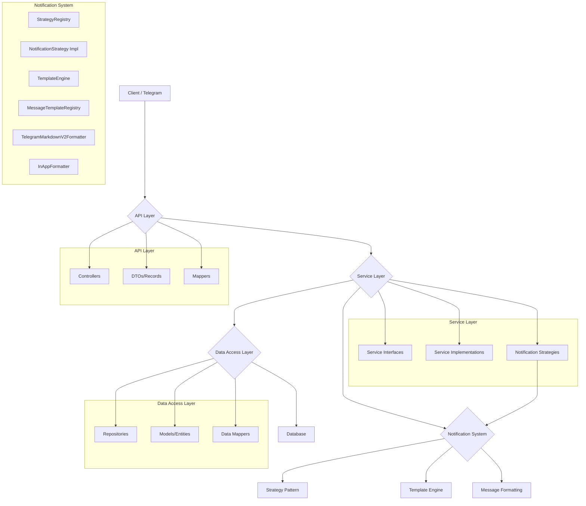

# System Patterns: Geohod Backend

## Core Architecture: Layered Monolith with Strategic Enhancement

The application follows a classic layered (n-tier) architecture with **significant enhancements in the notification system** that implement advanced strategy and template patterns.


```mermaid
graph TD
    A[Client / Telegram] --> B{API Layer};
    B --> C{Service Layer};
    C --> D{Data Access Layer};
    D --> E[Database];
    
    C --> F{Notification System};
    F --> G[Strategy Pattern];
    F --> H[Template Engine];
    F --> I[Message Formatting];

    subgraph API Layer
        B1[Controllers]
        B2[DTOs/Records]
        B3[Mappers]
    end

    subgraph Service Layer
        C1[Service Interfaces]
        C2[Service Implementations]
        C3[Notification Strategies]
    end

    subgraph Notification System
        G1[StrategyRegistry]
        G2[NotificationStrategy Impl]
        H1[TemplateEngine]
        H2[MessageTemplateRegistry]
        I1[TelegramMarkdownV2Formatter]
        I2[InAppFormatter]
    end

    subgraph Data Access Layer
        D1[Repositories]
        D2[Models/Entities]
        D3[Data Mappers]
    end

    B --> B1 & B2 & B3;
    C --> C1 & C2 & C3;
    C3 --> F;
    D --> D1 & D2 & D3;
```

## Layer Breakdown (Updated November 2025)

### 1. API Layer (`me.geohod.geohodbackend.api`)
*   **Controllers**: REST controllers with `ResponseEntity<ApiResponse<T>>` wrapping. Enhanced with v3 endpoints.
*   **DTOs**: **Records-based design** with comprehensive validation (`@NotNull`, `@Min`, `@Max`). Split into request/response packages.
*   **Mappers**: MapStruct-generated mappers with global configuration for consistent mapping.
*   **Response Wrapper**: `ApiResponse<T>` ensures consistent API responses across all v2 endpoints.

### 2. Service Layer (`me.geohod.geohodbackend.service`)
*   **Service Interfaces**: Business logic contracts with clear separation of concerns.
*   **Service Implementations**: Transactional business logic with constructor injection.
*   **Notification Strategies**: **NEW**: Dedicated strategy implementations following the Strategy pattern.
*   **User Settings**: Granular service methods for individual settings updates.

### 3. Data Access Layer (`me.geohod.geohodbackend.data`)
*   **Repositories**: Spring Data JDBC repositories with custom queries and projections.
*   **Models/Entities**: All implement `Persistable<T>` with version control and optimistic locking.
*   **Data Mappers**: Internal mapping between entities and service DTOs.

### 4. **Enhanced Notification System** (`me.geohod.geohodbackend.service.notification`)
*   **Strategy Pattern**: Complete implementation with `StrategyRegistry` and type-safe strategy selection
*   **Template Engine**: Custom-built template processing with variables, conditionals, and fallbacks
*   **Message Formatting**: Channel-specific formatters (Telegram MarkdownV2, In-App plain text)
*   **Template Registry**: Centralized template management with initialization and fallback logic

## Key Design Patterns & Concepts

### Core Patterns
*   **Dependency Injection (DI)**: Constructor injection throughout, promoting testability and loose coupling.
*   **Repository Pattern**: Spring Data JDBC repositories abstract database operations.
*   **DTO Pattern**: Extensive use of records and DTOs for API contracts and internal data transfer.
*   **Persistable Pattern**: All entities implement `Persistable<T>` with `@Version` for optimistic locking.

### Advanced Patterns (November 2025)

#### 1. **Strategy Pattern for Notifications**
```java
@Component
public class StrategyRegistry {
    private final Map<StrategyNotificationType, NotificationStrategy> strategies;
    
    public void registerStrategy(StrategyNotificationType type, NotificationStrategy strategy);
    public Optional<NotificationStrategy> getStrategy(StrategyNotificationType type);
}
```

**Strategy Implementations**:
- `EventCreatedStrategy`: Handles new event notifications
- `EventCancelledStrategy`: Manages event cancellation notifications  
- `EventFinishedStrategy`: Processes event completion notifications
- `ParticipantRegisteredStrategy`: Handles participant registration
- `ParticipantUnregisteredStrategy`: Manages participant deregistration

#### 2. **Template Engine Pattern**
```java
@Component
public class TemplateEngine {
    // Variable interpolation: {{variable}}, {{variable|fallback}}, {{variable:50}}
    // Conditional blocks: {#if condition}content{/if}
    // Automatic fallback values for missing variables
}
```

**Features**:
- Regex-based variable processing with complex expressions
- Conditional content rendering with boolean evaluation
- Length limiting and fallback value support
- Safe escaping of special characters

#### 3. **Message Formatting Strategy**
```java
@Component  
public class TelegramMarkdownV2Formatter {
    // Sophisticated escaping for special characters
    // URL preservation for plain links
    // Markdown-specific formatting rules
}
```

**Formatters**:
- `TelegramMarkdownV2Formatter`: Complex escaping for Telegram's MarkdownV2
- `InAppFormatter`: Strips all formatting for plain text display

#### 4. **Template Registry Pattern**
```java
@Component
public class MessageTemplateRegistry {
    @PostConstruct
    public void initializeDefaultTemplates() {
        // Register default Russian-language templates
        // Support for multiple template types (TELEGRAM, IN_APP)
    }
}
```

#### 5. **Outbox Pattern**
*   **TelegramOutboxMessage**: Persistent queue for reliable notification delivery
*   **NotificationProcessorProgress**: Tracks processing state and enables retry mechanisms
*   **Asynchronous Processing**: Separate processor components for reliable delivery

### Legacy Patterns (Still in Use)
*   **Global Exception Handling**: `GlobalExceptionHandler` provides consistent error responses
*   **Security via Filters**: `TelegramInitDataAuthenticationFilter` handles custom authentication
*   **API Design with Defaults**: Optional request bodies with service-level default handling

## Module Structure (November 2025)

### Core Modules
- `api/`: REST controllers, DTOs, mappers, and response wrappers
- `service/`: Business logic, strategies, and external integrations  
- `data/`: Entities, repositories, projections, and data mappers
- `configuration/`: Spring configuration classes and properties
- `security/`: Custom authentication filters and principal classes
- `exception/`: Global exception handling

### Specialized Modules
- `user_settings/`: **NEW**: Complete user preferences management module
- `notification/`: **ENHANCED**: Sophisticated notification system with strategies and templates
- `mapper/`: Global MapStruct configuration and mappings

## API Layer Evolution

### v2 API Enhancements
*   **Multi-participant Registration**: `EventRegisterRequest` with `amountOfParticipants` (1-10)
*   **User Settings API**: Granular PUT endpoints for individual settings fields
*   **Enhanced User Endpoints**: User details and comprehensive statistics
*   **Response Consistency**: All endpoints use `ApiResponse<T>` wrapper

### API Design Principles
*   **Record-based DTOs**: Type-safe, immutable data transfer objects
*   **Comprehensive Validation**: Validation annotations on all request DTOs
*   **Backward Compatibility**: Optional request bodies with service-level defaults
*   **Consistent Response Format**: `ApiResponse<T>` for success and error cases

## Performance & Monitoring Patterns
*   **Database Optimization**: Strategic indexing and query optimization
*   **Metrics Collection**: Micrometer with Prometheus for observability  
*   **Health Monitoring**: Multi-level health checks and processing progress tracking
*   **Caching Strategy**: Projection-based queries to avoid N+1 problems

## Testing Patterns
*   **Testcontainers**: Real PostgreSQL instances for integration testing
*   **Strategy Testing**: Dedicated test suites for notification strategies
*   **Template Engine Testing**: Comprehensive template processing tests
*   **Security Testing**: Spring Security Test integration for authentication flows
