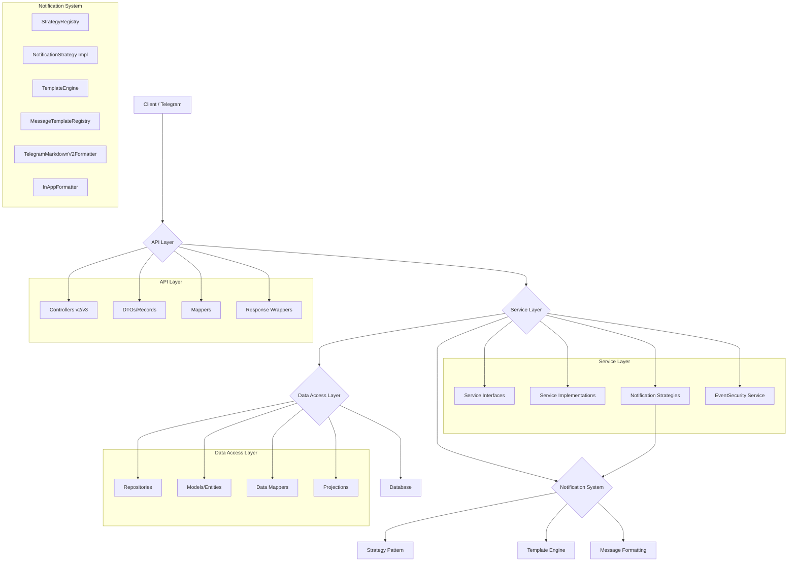

# System Patterns: Geohod Backend

## Core Architecture: Layered Monolith with Strategic Enhancement

The application follows a classic layered (n-tier) architecture with **significant enhancements in the notification system** that implement advanced strategy and template patterns, and **API v3 development** with enhanced user management capabilities.


```mermaid
graph TD
    A[Client / Telegram] --> B{API Layer};
    B --> C{Service Layer};
    C --> D{Data Access Layer};
    D --> E[Database];
    
    C --> F{Notification System};
    F --> G[Strategy Pattern];
    F --> H[Template Engine];
    F --> I[Message Formatting];

    subgraph API Layer
        B1[Controllers v2/v3]
        B2[DTOs/Records]
        B3[Mappers]
        B4[Response Wrappers]
    end

    subgraph Service Layer
        C1[Service Interfaces]
        C2[Service Implementations]
        C3[Notification Strategies]
        C4[EventSecurity Service]
    end

    subgraph Notification System
        G1[StrategyRegistry]
        G2[NotificationStrategy Impl]
        H1[TemplateEngine]
        H2[MessageTemplateRegistry]
        I1[TelegramMarkdownV2Formatter]
        I2[InAppFormatter]
    end

    subgraph Data Access Layer
        D1[Repositories]
        D2[Models/Entities]
        D3[Data Mappers]
        D4[Projections]
    end

    B --> B1 & B2 & B3 & B4;
    C --> C1 & C2 & C3 & C4;
    C3 --> F;
    D --> D1 & D2 & D3 & D4;
```

## Layer Breakdown (Updated November 2025)

### 1. API Layer (`me.geohod.geohodbackend.api`)
*   **Controllers**: REST controllers with `ResponseEntity<ApiResponse<T>` wrapping. **Enhanced**: v3 endpoints for user settings and statistics, v1 removal completed.
*   **DTOs**: **Records-based design** with comprehensive validation (`@NotNull`, `@Min`, `@Max`, `@Size`). **Enhanced**: API v3 DTOs with granular user settings and comprehensive user statistics.
*   **Mappers**: MapStruct-generated mappers with global configuration for consistent mapping.
*   **Response Wrapper**: `ApiResponse<T>` ensures consistent API responses across all v2/v3 endpoints.
*   **Pagination**: `PageResponse<T>` wrapper with metadata for consistent list responses.

### 2. Service Layer (`me.geohod.geohodbackend.service`)
*   **Service Interfaces**: Business logic contracts with clear separation of concerns.
*   **Service Implementations**: Transactional business logic with constructor injection.
*   **Notification Strategies**: **Enhanced**: Dedicated strategy implementations following the unified Strategy pattern.
*   **User Settings**: **Enhanced**: Granular service methods for individual settings updates with API v3 support.
*   **EventSecurity**: **NEW**: Dedicated service for event-specific authorization with method-level security integration.

### 3. Data Access Layer (`me.geohod.geohodbackend.data`)
*   **Repositories**: Spring Data JDBC repositories with custom queries and projections.
*   **Models/Entities**: All implement `Persistable<T>` with version control and optimistic locking. **Enhanced**: State management fields for events and participants.
*   **Data Mappers**: Internal mapping between entities and service DTOs.
*   **Projections**: **Enhanced**: EventDetailedProjection with state information and enhanced user statistics.

### 4. **Enhanced Notification System** (`me.geohod.geohodbackend.service.notification`)
*   **Strategy Pattern**: **Unified interface** with StrategyRegistry and type-safe strategy selection
*   **Template Engine**: Custom-built template processing with variables, conditionals, and fallbacks
*   **Message Formatting**: Channel-specific formatters (Telegram MarkdownV2, In-App plain text)
*   **Template Registry**: Centralized template management with initialization and fallback logic

## Key Design Patterns & Concepts

### Core Patterns
*   **Dependency Injection (DI)**: Constructor injection throughout, promoting testability and loose coupling.
*   **Repository Pattern**: Spring Data JDBC repositories abstract database operations with custom projections.
*   **DTO Pattern**: Extensive use of records and DTOs for API contracts and internal data transfer.
*   **Persistable Pattern**: All entities implement `Persistable<T>` with `@Version` for optimistic locking.
*   **State Management Pattern**: Boolean-based state tracking for events and participants with comprehensive API support
*   **SQL Optimization Pattern**: Dynamic query construction with StringBuilder and Map-based parameter binding
*   **JSON Serialization Pattern**: Jackson ObjectMapper for proper JSON formatting and data integrity
*   **Method-Level Security Pattern**: **NEW**: Declarative security using @PreAuthorize annotations and EventSecurity service
*   **API Versioning Pattern**: v1 (completely removed), v2 (primary), v3 (enhanced features) with backward compatibility
*   **Exception Handling Pattern**: **NEW**: Centralized exception handling with ResourceNotFoundException and proper HTTP status codes
*   **DTO Organization Pattern**: **ENHANCED**: Clear separation between API responses and data transfer objects

### Advanced Patterns (November 2025)

#### 1. **Unified Strategy Pattern for Notifications (Refactored & Enhanced)**
```java
@Component
public class StrategyRegistry {
    private final Map<StrategyNotificationType, NotificationStrategy> strategies;
    
    public void registerStrategy(StrategyNotificationType type, NotificationStrategy strategy);
    public Optional<NotificationStrategy> getStrategy(StrategyNotificationType type);
}

public interface NotificationStrategy {
    // Shared methods for all channels
    StrategyNotificationType getType();
    boolean isValid(Event event, String payload);
    Collection<UUID> getRecipients(Event event, String payload);
    
    // Telegram-specific methods
    Map<String, Object> createTelegramParams(Event event, String payload);
    String formatTelegramMessage(Event event, User author, Map<String, Object> params);
    
    // In-App-specific methods
    NotificationCreateDto createInAppNotification(UUID userId, Event event, String payload);
}
```

**Enhanced Strategy Implementations**:
- `EventCreatedStrategy`: Handles new event notifications with unified interface
- `EventCancelledStrategy`: Manages event cancellation notifications  
- `EventFinishedStrategy`: Processes event completion notifications
- `ParticipantRegisteredStrategy`: Handles participant registration
- `ParticipantUnregisteredStrategy`: Manages participant deregistration

**Key Improvements**:
- **Unified Interface**: Single `NotificationStrategy` replaces separate Telegram/In-App strategies
- **Method Separation**: Channel-specific methods with proper parameter handling
- **Registry Delegation**: All processors delegate to `StrategyRegistry` for strategy selection
- **Code Deduplication**: Eliminated hardcoded recipient determination and DTO creation logic
- **Enhanced Validation**: Comprehensive event and payload validation in strategies

#### 2. **API v3 Pattern (November 2025)**
```java
@RestController
@RequestMapping("/api/v2/user/settings")
public class UserSettingsController {
    @PutMapping("/default-max-participants")
    public ApiResponse<UserSettingsResponse> updateDefaultMaxParticipants(
            @RequestBody DefaultMaxParticipantsRequest request,
            @AuthenticationPrincipal TelegramPrincipal principal) {
        // Granular settings update implementation
    }
    
    @PutMapping("/payment-gateway-url")
    public ApiResponse<UserSettingsResponse> updatePaymentGatewayUrl(
            @RequestBody PaymentGatewayUrlRequest request,
            @AuthenticationPrincipal TelegramPrincipal principal) {
        // Payment gateway URL update implementation
    }
}

@GetMapping("/api/v2/users/{id}/stats")
public ApiResponse<UserStatsResponse> getUserStats(@PathVariable UUID id) {
    // Comprehensive user statistics calculation
}

public record UserStatsResponse(
    Double overallRating,
    Integer reviewsCount,
    Integer eventsCount,
    Integer eventsParticipantsCount,
    Map<Integer, Long> reviewsByRating  // Guaranteed keys 1-5
) {}
```

**Features**:
- **Granular API**: Dedicated endpoints for individual user settings
- **Comprehensive Statistics**: User ratings, event counts, review distribution
- **Enhanced Profiles**: Avatar images, contact information, detailed user data
- **Validation**: Comprehensive DTO validation with proper error handling

#### 3. **Template Engine Pattern (Enhanced)**
```java
@Component
public class TemplateEngine {
    // Variable interpolation: {{variable}}, {{variable|fallback}}, {{variable:50}}
    // Conditional blocks: {#if condition}content{/if}
    // Automatic fallback values for missing variables
    // Russian language support with proper encoding
}
```

**Features**:
- Regex-based variable processing with complex expressions
- Conditional content rendering with boolean evaluation
- Length limiting and fallback value support
- Safe escaping of special characters
- Russian language template support

#### 4. **Message Formatting Strategy (Enhanced)**
```java
@Component  
public class TelegramMarkdownV2Formatter {
    // Sophisticated escaping for special characters
    // URL preservation for plain links
    // Markdown-specific formatting rules
    // Proper handling of parentheses and backslashes
}
```

**Formatters**:
- `TelegramMarkdownV2Formatter`: Complex escaping for Telegram's MarkdownV2 with URL preservation
- `InAppFormatter`: Strips all formatting for plain text display
- **Enhanced Escaping**: Proper handling of markdown special characters and URL formatting

#### 5. **Refactored Processor Pattern (November 2025)**

**Processor Architecture Improvements**:
```java
@Component
public class InAppNotificationProcessor {
    private final StrategyRegistry strategyRegistry;
    
    @Scheduled(fixedDelayString = "${geohod.processor.in-app.delay:5000}")
    @Transactional
    public void process() {
        List<EventLog> unprocessedLogs = eventLogService.findUnprocessed(100, PROCESSOR_NAME);
        
        for (EventLog eventLog : unprocessedLogs) {
            processEventLog(eventLog);
        }
    }
    
    private void processEventLog(EventLog eventLog) {
        strategyRegistry.getStrategy(type).ifPresentOrElse(
                strategy -> processWithStrategy(strategy, event, eventLog),
                () -> log.warn("No strategy found for type: {}", type));
    }
}
```

**Key Changes**:
- **Strategy Delegation**: Processors delegate logic to appropriate strategies
- **Scheduled Processing**: Regular processing with configurable delays
- **Error Handling**: Comprehensive exception handling with logging
- **Progress Tracking**: Update processing progress for reliability

#### 6. **State Management Pattern (November 2025)**
```java
@Entity
public class Event {
    private boolean sendPollLink;
    private boolean donationCash;
    private boolean donationTransfer;
}

@Entity
public class EventParticipant {
    private boolean pollLinkSent;
    private boolean cashDonated;
    private boolean transferDonated;
}

public record UpdateParticipantStateRequest(
    boolean pollLinkSent,
    boolean cashDonated,
    boolean transferDonated
) {
    // Validation annotations for comprehensive input validation
}
```

**Features**:
- **Event-Level States**: Track poll link sending preferences and donation acceptance at event level
- **Participant-Level States**: Track individual participant progress for poll delivery and donation completion
- **Atomic Updates**: Transactional state updates via dedicated API endpoint
- **Database Integration**: Boolean fields with proper defaults and constraints via Liquibase migrations
- **API Integration**: State information included in event details and projections

#### 7. **SQL Optimization Pattern (November 2025)**
```java
@Component
public class EventProjectionRepository {
    public Page<EventDetailedProjection> events(...) {
        StringBuilder whereClause = new StringBuilder(" WHERE 1=1 ");
        Map<String, Object> params = new HashMap<>();
        
        if (authorUserId != null) {
            whereClause.append(" AND e.author_id = :authorUserId ");
            params.put("authorUserId", authorUserId);
        }
        
        // Dynamic WHERE clause construction
        // Map-based parameter binding
        // Separation of SQL components for clarity
    }
}
```

**Features**:
- **Dynamic SQL Construction**: StringBuilder for building WHERE clauses dynamically
- **Parameter Binding**: HashMap-based named parameters for better performance
- **Query Separation**: Base SQL, WHERE clause, and ORDER BY separated for clarity
- **Performance Benefits**: Optimized query execution and better database performance

#### 8. **JSON Serialization Pattern (November 2025)**
```java
@Service
public class EventService {
    private final ObjectMapper objectMapper;
    
    private String toJson(Object data) {
        try {
            return objectMapper.writeValueAsString(data);
        } catch (JsonProcessingException e) {
            throw new RuntimeException("Failed to serialize event log payload", e);
        }
    }
}
```

**Features**:
- **Jackson Integration**: ObjectMapper for proper JSON serialization
- **Error Handling**: RuntimeException for serialization failures
- **Consistent Format**: Structured JSON for event log payloads
- **Data Integrity**: Prevents formatting errors in log entries

#### 9. **Exception Handling Pattern (November 2025)**

**Centralized Exception Management**:
```java
// New ResourceNotFoundException for proper HTTP 404
public class ResourceNotFoundException extends RuntimeException {
    public ResourceNotFoundException(String message) {
        super(message);
    }
}

// GlobalExceptionHandler with comprehensive exception mapping
@RestControllerAdvice
public class GlobalExceptionHandler {
    @ExceptionHandler(ResourceNotFoundException.class)
    public ResponseEntity<ApiResponse<?>> handleResourceNotFoundException(
            ResourceNotFoundException e, HttpServletRequest request) {
        return ResponseEntity.status(HttpStatus.NOT_FOUND)
                .body(ApiResponse.error(e.getMessage()));
    }
}
```

**Enhanced ReviewController Pattern**:
```java
@GetMapping("/{eventId}")
public ApiResponse<ReviewResponse> getUserReviewForEvent(
        @PathVariable UUID eventId,
        @AuthenticationPrincipal TelegramPrincipal principal) {
    var reviewOptional = reviewService.getUserReviewForEvent(principal.userId(), eventId);
    return reviewOptional
            .map(review -> ApiResponse.success(reviewApiMapper.map(review)))
            .orElseThrow(() -> new ResourceNotFoundException("Review not found for this event"));
}
```

**Key Features**:
- **Proper HTTP Status Codes**: HTTP 404 NOT_FOUND instead of custom error responses
- **Centralized Error Management**: Single GlobalExceptionHandler for all exceptions
- **Exception-Based Flow**: Controllers throw exceptions instead of manually handling error responses
- **API Consistency**: Uniform error handling across all endpoints
- **Better Client Experience**: Standard HTTP status codes for proper client-side error handling

**Benefits Achieved**:
- **Consistency**: Uniform error handling approach across all controllers
- **Maintainability**: Centralized exception handling logic reduces code duplication
- **Client Experience**: Proper HTTP status codes enable better error handling on client side
- **Clean Controllers**: Controllers focus on business logic, not error response construction

#### 10. **Method-Level Security Pattern (November 2025)**

**Security Modernization and API Cleanup**:
```java
@Service
public class EventSecurity {
    public boolean isEventAuthor(UUID eventId) {
        Authentication authentication = SecurityContextHolder.getContext().getAuthentication();
        if (eventId == null || authentication == null
                || !(authentication.getPrincipal() instanceof TelegramPrincipal principal)) {
            return false;
        }
        return eventRepository.findById(eventId)
                .map(Event::getAuthorId)
                .map(authorId -> authorId.equals(principal.userId()))
                .orElse(false);
    }
}

@RestController
@RequestMapping("/api/v2/events")
public class EventController {
    @PutMapping("/{eventId}")
    @PreAuthorize("@eventSecurity.isEventAuthor(#eventId)")
    public ApiResponse<EventUpdateResponse> updateEvent(@PathVariable UUID eventId,
            @RequestBody EventUpdateRequest request,
            @AuthenticationPrincipal TelegramPrincipal principal) {
        // Implementation without manual authorization checks
    }
}
```

**Key Features**:
- **Declarative Security**: @PreAuthorize annotations replace manual AccessDeniedException checks
- **Centralized Authorization**: EventSecurity service handles all event-specific authorization logic
- **Method-Level Security**: @EnableMethodSecurity annotation enables method-level security configuration
- **Security Context Integration**: Direct access to authentication and principal for authorization decisions
- **Repository Integration**: Direct database queries for authorization validation
- **Code Cleanup**: Eliminated duplicate authorization logic across controller methods

**Benefits Achieved**:
- **Maintainability**: Single source of truth for event authorization logic
- **Security**: Centralized and tested authorization logic
- **Clean Code**: Removed boilerplate AccessDeniedException checks
- **Modern Architecture**: Declarative security preparing for API v3 evolution

#### 10. **DTO Organization Pattern (November 2025)**

**Architectural Layer Separation**:
```java
// Moved from API layer to data layer for proper architecture
// Before: src/main/java/me/geohod/geohodbackend/api/dto/response/TelegramUserDetails.java
// After: src/main/java/me/geohod/geohodbackend/data/dto/TelegramUserDetails.java

public record TelegramUserDetails(
        String id,
        String username,
        String firstName,
        String lastName,
        String imageUrl
) {
    @JsonProperty("name")
    public String getName() {
        return Stream.of(firstName, lastName)
                .filter(name -> name != null && !name.isBlank())
                .collect(Collectors.joining(" "));
    }
}
```

**Key Features**:
- **Layer Separation**: Clear separation between API responses and internal data transfer
- **Jackson Integration**: Proper JSON serialization annotations for API compatibility
- **Architectural Clarity**: DTOs belong in data layer, not API response layer
- **Reusability**: Data DTOs can be used across different API layers and services

**Benefits Achieved**:
- **Clean Architecture**: Proper separation of concerns between API and data layers
- **Maintainability**: Clear organization of DTOs by their intended use
- **Consistency**: Uniform approach to data transfer object organization
- **Reusability**: Data DTOs can be used across multiple API endpoints

#### 11. **Template Registry Pattern**
```java
@Component
public class MessageTemplateRegistry {
    @PostConstruct
    public void initializeDefaultTemplates() {
        // Register default Russian-language templates
        // Support for multiple template types (TELEGRAM, IN_APP)
        // Default fallback handling
    }
}
```

#### 11. **Outbox Pattern**
*   **TelegramOutboxMessage**: Persistent queue for reliable notification delivery
*   **NotificationProcessorProgress**: Tracks processing state and enables retry mechanisms
*   **Asynchronous Processing**: Separate processor components for reliable delivery
*   **Processing Reliability**: Scheduled processing with progress tracking and error handling

## Module Structure (November 2025)

### Core Modules
- `api/`: REST controllers (v2/v3), DTOs, mappers, and response wrappers
- `service/`: Business logic, strategies, external integrations, and security services  
- `data/`: Entities, repositories, projections, and data mappers with state management
- `configuration/`: Spring configuration classes and properties
- `security/`: Custom authentication filters, principals, and authorization services
- `exception/`: Global exception handling with comprehensive error responses

### Specialized Modules
- `user_settings/`: **Enhanced**: Complete user preferences management with API v3 support
- `notification/`: **Enhanced**: Sophisticated notification system with strategies, templates, and formatters
- `mapper/`: Global MapStruct configuration and mappings with comprehensive type safety
- `security/`: **NEW**: EventSecurity service for centralized authorization logic

## API Layer Evolution

### v1 API (Completely Removed - November 2025)
*   **Complete Elimination**: All legacy v1 endpoints fully removed including EventParticipationController
*   **Benefits**: Reduced complexity, improved maintainability, clearer API surface
*   **Final Cleanup**: No remaining v1 controllers or endpoints in codebase

### v2 API Enhancements
*   **Multi-participant Registration**: `EventRegisterRequest` with `amountOfParticipants` (1-10)
*   **State Management API**: **NEW**: `UpdateParticipantStateRequest` for managing participant state transitions
*   **User Settings API**: Granular PUT endpoints for individual settings fields with API v3 enhancement
*   **Enhanced User Endpoints**: User details and comprehensive statistics with API v3 features
*   **Response Consistency**: All endpoints use `ApiResponse<T>` wrapper with comprehensive error handling
*   **Event State Display**: Enhanced `EventDetailsResponse` and `EventDetailedProjection` with state information
*   **Dynamic Sorting**: Enhanced with dynamic ORDER BY clause building based on Pageable parameters

### v3 API Development (November 2025)
*   **Enhanced User Settings**: Four dedicated PUT endpoints for granular settings updates
*   **User Statistics**: Comprehensive user stats with ratings, event counts, and review distribution
*   **User Details**: Enhanced profile retrieval with avatar images and contact information
*   **API Documentation**: Complete API contract with JSON examples and response formats
*   **Validation**: Comprehensive DTO validation with @Min, @Max, @NotNull annotations

### API Design Principles
*   **Record-based DTOs**: Type-safe, immutable data transfer objects with comprehensive validation
*   **Comprehensive Validation**: Validation annotations on all request DTOs with proper error messages
*   **Backward Compatibility**: Optional request bodies with service-level defaults for existing clients
*   **Consistent Response Format**: `ApiResponse<T>` for success and error cases with proper error handling
*   **Security Integration**: Method-level security with @PreAuthorize annotations and EventSecurity service
*   **Exception-Based Error Handling**: **ENHANCED**: Proper HTTP status codes with centralized exception handling via ResourceNotFoundException
*   **Architectural DTO Organization**: **ENHANCED**: Clear separation between API responses and data transfer objects

## Performance & Monitoring Patterns
*   **Database Optimization**: 16+ Liquibase changelogs with performance indexes and state management
*   **Metrics Collection**: Micrometer with Prometheus for comprehensive observability
*   **Health Monitoring**: Multi-level health checks (database, disk space, application state) with liveness/readiness
*   **Processing Tracking**: Notification processing progress tracking for reliability and retry mechanisms
*   **Query Optimization**: SQL query optimization with dynamic construction and parameter binding
*   **JSON Processing**: Jackson ObjectMapper integration for proper serialization and data integrity

## Testing Patterns (Enhanced November 2025)
*   **Testcontainers**: Real PostgreSQL instances for integration testing with comprehensive coverage
*   **Strategy Testing**: Dedicated test suites for notification strategies with unified interface testing
*   **Template Engine Testing**: Comprehensive template processing tests with Russian language support
*   **Security Testing**: Spring Security Test integration for authentication and authorization flows
*   **State Management Testing**: Comprehensive tests for event and participant state transitions
*   **API Testing**: Enhanced API v3 testing with DTO validation and response format verification

## Database Evolution Patterns (16 Migrations)

### Core Schema (v1.0-v1.9)
- Events, users, participation, reviews, notifications
- Event logs and notification processing
- Performance indexes and query optimization

### State Management (v2.0-v2.4)
- Event and participant state tracking fields
- User settings enhancement with payment gateway URL
- Organizer advertisement preferences
- Performance indexes for user settings access
- Data migration for existing users

### Migration Patterns
- **Idempotent Changes**: All migrations are safe to re-run
- **Default Values**: Proper defaults for all new fields (false for boolean, null for optional)
- **Data Migration**: Proper handling of existing data with backward compatibility
- **Index Strategy**: Strategic indexing for performance optimization
